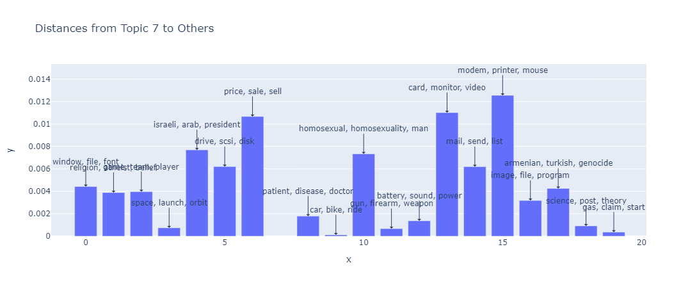
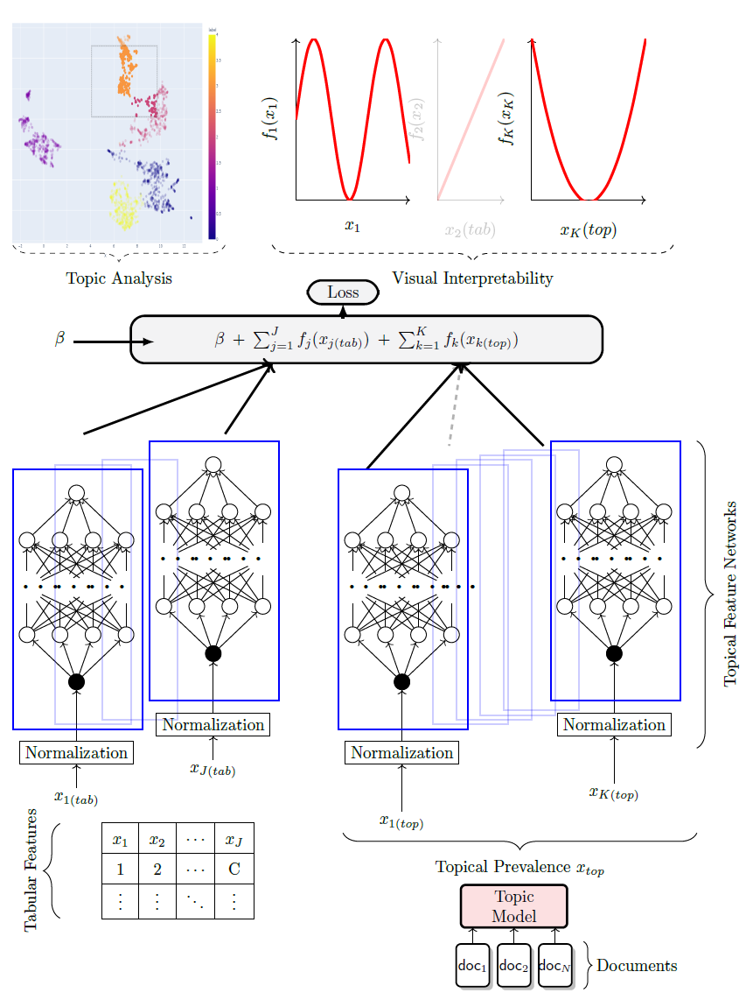

# ExpandedTM


<div style="text-align: center;">
    
</div>


Available Models
=================

| **Name**                                                                                                                                      | **Implementation**                                                      |
| --------------------------------------------------------------------------------------------------------------------------------------------- | ----------------------------------------------------------------------- |
| [WordCluTM](https://arxiv.org/abs/2004.14914)                                                                                                 | Tired of topic models?                                                  |
| [CEDC](https://direct.mit.edu/coli/article/doi/10.1162/coli_a_00506/118990/Topics-in-the-Haystack-Enhancing-Topic-Quality?searchresult=1)     | Topics in the Haystack                                                  |
| [DCTE](https://arxiv.org/pdf/2212.09422.pdf)                                                                                                  | Human in the Loop                                                       |
| [KMeansTM](https://direct.mit.edu/coli/article/doi/10.1162/coli_a_00506/118990/Topics-in-the-Haystack-Enhancing-Topic-Quality?searchresult=1) | Simple Kmeans followed by c-tfidf                                       |
| [SomTM](https://citeseerx.ist.psu.edu/document?repid=rep1&type=pdf&doi=b3c81b523b1f03c87192aa2abbf9ffb81a143e54)                              | Self organizing map followed by c-tfidf                                 |
| [CBC](https://ieeexplore.ieee.org/abstract/document/10066754)                                                                                 | Coherence based document clustering                                     |
| TNTM_bow                                                                                                                                      | Transformer-Representation Neural Topic Model using bag-of-words        |
| TNTM_SentenceTransformer                                                                                                                      | Transformer-Representation Neural Topic Model using SentenceTransformer |

Available (Additional) Metrics
=================

| **Name**                                                                                                                                                 | **Description**                                                                                                                                                        |
| -------------------------------------------------------------------------------------------------------------------------------------------------------- | ---------------------------------------------------------------------------------------------------------------------------------------------------------------------- |
| [ISIM](https://direct.mit.edu/coli/article/doi/10.1162/coli_a_00506/118990/Topics-in-the-Haystack-Enhancing-Topic-Quality?searchresult=1)                | Average cosine similarity of top words of a topic to an intruder word.                                                                                                 |
| [INT](https://direct.mit.edu/coli/article/doi/10.1162/coli_a_00506/118990/Topics-in-the-Haystack-Enhancing-Topic-Quality?searchresult=1)                 | For a given topic and a given intruder word, Intruder Accuracy is the fraction of top words to which the intruder has the least similar embedding among all top words. |
| [ISH](https://direct.mit.edu/coli/article/doi/10.1162/coli_a_00506/118990/Topics-in-the-Haystack-Enhancing-Topic-Quality?searchresult=1)                 | calculates the shift in the centroid of a topic when an intruder word is replaced.                                                                                     |
| [Expressivity](https://direct.mit.edu/coli/article/doi/10.1162/coli_a_00506/118990/Topics-in-the-Haystack-Enhancing-Topic-Quality?searchresult=1)        | Cosine Distance of topics to meaningless (stopword) embedding centroid                                                                                                 |
| [Embedding Topic Diversity](https://link.springer.com/chapter/10.1007/978-3-030-80599-9_4)                                                               | Topic diversity in the embedding space                                                                                                                                 |
| [Embedding Coherence](https://direct.mit.edu/coli/article/doi/10.1162/coli_a_00506/118990/Topics-in-the-Haystack-Enhancing-Topic-Quality?searchresult=1) | Cosine similarity between the centroid of the embeddings of the stopwords and the centroid of the topic.                                                               |
| [NPMI](https://aclanthology.org/E14-1056.pdf)                                                                                                            | Classical NPMi coherence computed on the scource corpus.                                                                                                               |


Available Datasets
=================

| Name                  | # Docs  | # Words | # Features | Description                                                                                      |
| --------------------- | ------- | ------- | ---------- | ------------------------------------------------------------------------------------------------ |
| Spotify_most_popular  | 4,538   | 53,181  | 14         | Spotify dataset comprised of popular song lyrics and various tabular features.                   |
| Spotify_least_popular | 4,374   | 111,738 | 14         | Spotify dataset comprised of less popular song lyrics and various tabular features.              |
| Spotify               | 4,185   | 80,619  | 14         | General Spotify dataset with song lyrics and various tabular features.                           |
| Reddit_GME            | 21,549  | 21,309  | 6          | Reddit dataset filtered for "Gamestop" (GME) from the Subreddit "r/wallstreetbets".              |
| Stocktwits_GME        | 11,114  | 19,383  | 3          | Stocktwits dataset filtered for "Gamestop" (GME), covering the GME short squeeze of 2021.        |
| Stocktwits_GME_large  | 136,138 | 80,435  | 3          | Larger Stocktwits dataset filtered for "Gamestop" (GME), covering the GME short squeeze of 2021. |
| Reuters               | 8,929   | 24,803  | -          | Preprocessed Reuters dataset well suited for comparing topic model outputs.                      |
| Poliblogs             | 13,246  | 70,726  | 4          | Preprocessed Poliblogs dataset well suited for comparing topic model outputs.                    |
|                       |

## Usage

To use these models, follow the steps below:

1. Import the necessary modules:

    ```python
    from ExpandedTM.models import CEDC, KmeansTM, DCTE
    from ExpandedTM.data_utils import TMDataset
    ```

2. Get your dataset and data directory:

    ```python
    data = TMDataset()

    data.fetch_dataset("20NewsGroup")
    ```

3. Choose the model you want to use and train it:

    ```python
    model = CEDC(num_topics=20)
    output = model.train_model(dataset)
    ```

4. Evaluate the model using either Octis evaluation metrics or newly defined ones such as INT or ISIM:

    ```python
    from ExpandedTM.metrics import ISIM, INT

    metric = ISIM(dataset)
    metric.score(output)
    ```

5. Score per topic


    ```python
    metric.score_per_topic(output)
    ```

6. Visualize the results:
    ```python
    from ExpandedTM.visuals import visualize_topic_model, visualize_topics

    visualize_topic_model(
        model, 
        reduce_first=True, 
        port=8051,
        )
    ```

<div style="text-align: center;">
    
</div>


## Downstream Tasks


<div style="text-align: center;">
    
</div>

The general formulation of a Neural Additive Model (NAM) can be summarized by the equation:

$$
E(y) = h(β + ∑_{j=1}^{J} f_j(x_j)),
$$

where $h(·)$ denotes the activation function in the output layer, such as a linear activation for regression tasks or softmax for classification tasks. $x ∈ R^j$ represents the input features, and $β$ is the intercept. The function $f_j : R → R$ corresponds to the Multi-Layer Perceptron (MLP) for the $j$-th feature.

Let's consider $x$ as a combination of categorical and numerical features $x_{tab}$ and document features $x_{doc}$. After applying a topic model, STREAM extracts topical prevalences from documents, effectively transforming the input into $z ≡ (x_{tab}, x_{top})$, a probability vector over documents and topics. Here, $x_{j(tab)}^{(i)}$ indicates the $j$-th tabular feature of the $i$-th observation, and $x_{k(top)}^{(i)}$ represents the $i$-th document's topical prevalence for topic $k$.

For preserving interpretability, the downstream model is defined as:

$$
h(E[y]) = β + ∑_{j=1}^{J} f_j(x_{j(tab)}) + ∑_{k=1}^{K} f_k(x_{k(top)}),
$$

In this setup, visualizing the shape function `k` reveals the impact of a topic on the target variable `y`. For example, in the context of the Spotify dataset, this could illustrate how a topic influences a song's popularity.

Fitting a downstream model with a pre-trained topic model is straightforward using the PyTorch Trainer class. Subsequently, visualizing all shape functions can be done similarly to the approach described by Agarwal et al. (2021).

### Python Example

```python
from pytorch_lightning import Trainer
from STREAM.downstream import DownstreamModel

# Instantiate the DownstreamModel
downstream_model = DownstreamModel(
    trained_topic_model=topic_model,
    target_column='popularity',  # Target variable
    task='regression',  # or 'classification'
    dataset=dataset,  
    batch_size=128,
    lr=0.0005
)

# Use PyTorch Lightning's Trainer to train and validate the model
trainer = Trainer(max_epochs=10)
trainer.fit(downstream_model)

# Plotting
downstream_model.plot_feature_nns()
```
