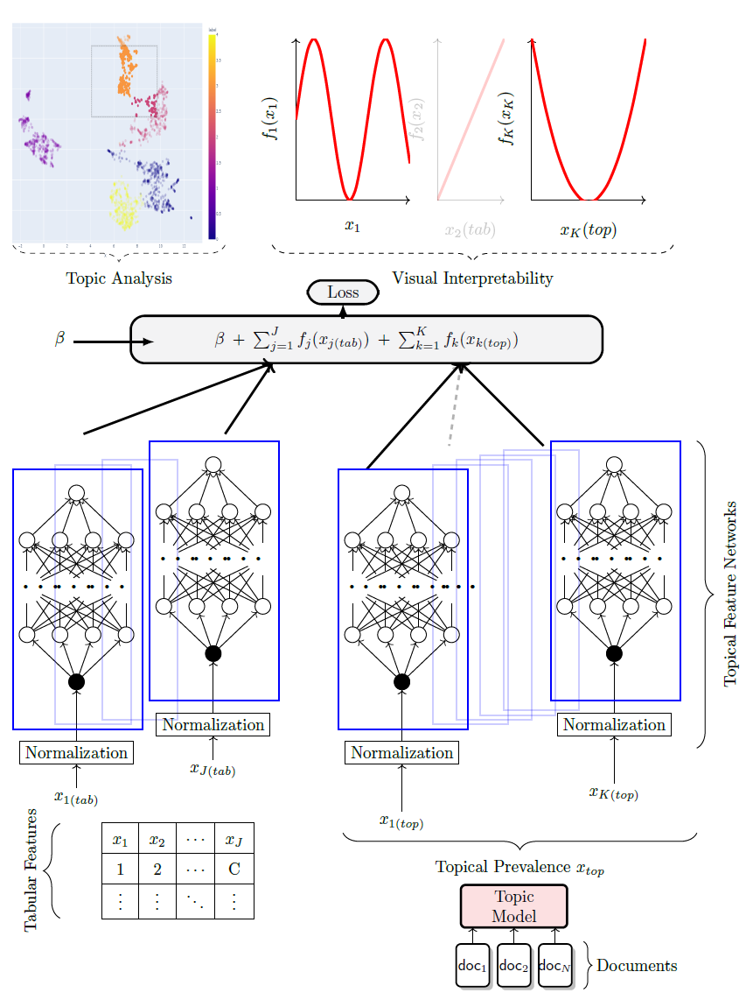

# STREAM
We present STREAM, a Simplified Topic Retrieval, Exploration, and Analysis Module for user-friendly topic modelling and especially subsequent interactive topic visualization and analysis. For better topic analysis, we implement multiple intruder-word based topic evaluation metrics. Additionally, we publicize multiple new datasets that can extend the so far very limited number of publicly available benchmark datasets in topic modeling. We integrate downstream interpretable analysis modules to enable users to easily analyse the created topics in downstream tasks together with additional tabular information.

#### Octis
The core of the STREAM package is built on top of the [OCTIS](https://aclanthology.org/2021.eacl-demos.31.pdf) framework and allows seamless integration of all of OCTIS' multitude of models, datasets, evaluation metrics and hyperparameter optimization techniques. See the [Octis Github](https://github.com/MIND-Lab/OCTIS) repository for an overview.

#### Speed
Since most of STREAMs models are centered around Document embeddings, STREAM comes along with a set of pre-embedded datasets.
Additionally, once a user fits a model that leverages document embeddings, the embeddings are saved and automatically loaded the next time the user wants to fit any model with the same set of embeddings.

<div style="text-align: center;">
    
</div>

Installation
=============
Since we are currently under review and wish to maintain anonymity, STREAM is not yet available on PyPI. To install STREAM, you can install it directly from the GitHub repository using the following command:

```sh
pip install git+https://github.com/AnFreTh/STREAM.git
```

Make additionally sure to download the necessary [nltk](https://www.nltk.org/) ressources, e.g. via:

```python
import nltk
nltk.download('averaged_perceptron_tagger')
```

Available Models
=================

| **Name**                                                                                                                                      | **Implementation**                      |
| --------------------------------------------------------------------------------------------------------------------------------------------- | --------------------------------------- |
| [WordCluTM](https://arxiv.org/abs/2004.14914)                                                                                                 | Tired of topic models?                  |
| [CEDC](https://direct.mit.edu/coli/article/doi/10.1162/coli_a_00506/118990/Topics-in-the-Haystack-Enhancing-Topic-Quality?searchresult=1)     | Topics in the Haystack                  |
| [DCTE](https://arxiv.org/pdf/2212.09422.pdf)                                                                                                  | Human in the Loop                       |
| [KMeansTM](https://direct.mit.edu/coli/article/doi/10.1162/coli_a_00506/118990/Topics-in-the-Haystack-Enhancing-Topic-Quality?searchresult=1) | Simple Kmeans followed by c-tfidf       |
| [SomTM](https://citeseerx.ist.psu.edu/document?repid=rep1&type=pdf&doi=b3c81b523b1f03c87192aa2abbf9ffb81a143e54)                              | Self organizing map followed by c-tfidf |
| [CBC](https://ieeexplore.ieee.org/abstract/document/10066754)                                                                                 | Coherence based document clustering     |

Available (Additional) Metrics
=================

| **Name**                                                                                                                                                 | **Description**                                                                                                                                                        |
| -------------------------------------------------------------------------------------------------------------------------------------------------------- | ---------------------------------------------------------------------------------------------------------------------------------------------------------------------- |
| [ISIM](https://direct.mit.edu/coli/article/doi/10.1162/coli_a_00506/118990/Topics-in-the-Haystack-Enhancing-Topic-Quality?searchresult=1)                | Average cosine similarity of top words of a topic to an intruder word.                                                                                                 |
| [INT](https://direct.mit.edu/coli/article/doi/10.1162/coli_a_00506/118990/Topics-in-the-Haystack-Enhancing-Topic-Quality?searchresult=1)                 | For a given topic and a given intruder word, Intruder Accuracy is the fraction of top words to which the intruder has the least similar embedding among all top words. |
| [ISH](https://direct.mit.edu/coli/article/doi/10.1162/coli_a_00506/118990/Topics-in-the-Haystack-Enhancing-Topic-Quality?searchresult=1)                 | calculates the shift in the centroid of a topic when an intruder word is replaced.                                                                                     |
| [Expressivity](https://direct.mit.edu/coli/article/doi/10.1162/coli_a_00506/118990/Topics-in-the-Haystack-Enhancing-Topic-Quality?searchresult=1)        | Cosine Distance of topics to meaningless (stopword) embedding centroid                                                                                                 |
| [Embedding Topic Diversity](https://link.springer.com/chapter/10.1007/978-3-030-80599-9_4)                                                               | Topic diversity in the embedding space                                                                                                                                 |
| [Embedding Coherence](https://direct.mit.edu/coli/article/doi/10.1162/coli_a_00506/118990/Topics-in-the-Haystack-Enhancing-Topic-Quality?searchresult=1) | Cosine similarity between the centroid of the embeddings of the stopwords and the centroid of the topic.                                                               |
| [NPMI](https://aclanthology.org/E14-1056.pdf)                                                                                                            | Classical NPMi coherence computed on the scource corpus.                                                                                                               |


Available Datasets
=================

| Name                  | # Docs  | # Words | # Features | Description                                                                                      |
| --------------------- | ------- | ------- | ---------- | ------------------------------------------------------------------------------------------------ |
| Spotify_most_popular  | 4,538   | 53,181  | 14         | Spotify dataset comprised of popular song lyrics and various tabular features.                   |
| Spotify_least_popular | 4,374   | 111,738 | 14         | Spotify dataset comprised of less popular song lyrics and various tabular features.              |
| Spotify               | 4,185   | 80,619  | 14         | General Spotify dataset with song lyrics and various tabular features.                           |
| Reddit_GME            | 21,549  | 21,309  | 6          | Reddit dataset filtered for "Gamestop" (GME) from the Subreddit "r/wallstreetbets".              |
| Stocktwits_GME        | 11,114  | 19,383  | 3          | Stocktwits dataset filtered for "Gamestop" (GME), covering the GME short squeeze of 2021.        |
| Stocktwits_GME_large  | 136,138 | 80,435  | 3          | Larger Stocktwits dataset filtered for "Gamestop" (GME), covering the GME short squeeze of 2021. |
| Reuters               | 8,929   | 24,803  | -          | Preprocessed Reuters dataset well suited for comparing topic model outputs.                      |
| Poliblogs             | 13,246  | 70,726  | 4          | Preprocessed Poliblogs dataset well suited for comparing topic model outputs.                    |
|                       |

## Usage

To use these models, follow the steps below:

1. Import the necessary modules:

    ```python
    from stream.models import CEDC, KmeansTM, DCTE
    from stream.data_utils import TMDataset
    ```

2. Get your dataset and data directory:

    ```python
    dataset = TMDataset()

    dataset.fetch_dataset("20NewsGroup")
    ```

3. Choose the model you want to use and train it:

    ```python
    model = CEDC(num_topics=20)
    output = model.train_model(dataset)
    ```

4. Evaluate the model using either Octis evaluation metrics or newly defined ones such as INT or ISIM:

    ```python
    from stream.metrics import ISIM, INT

    metric = ISIM(dataset)
    metric.score(output)
    ```

5. Score per topic


    ```python
    metric.score_per_topic(output)
    ```

6. Visualize the results:
    ```python
    from stream.visuals import visualize_topic_model, visualize_topics

    visualize_topic_model(
        model, 
        reduce_first=True, 
        port=8051,
        )
    ```

<div style="text-align: center;">
    
</div>


## Downstream Tasks


<div style="text-align: center;">
    
</div>

The general formulation of a Neural Additive Model (NAM) can be summarized by the equation:

$$
E(y) = h(β + ∑_{j=1}^{J} f_j(x_j)),
$$

where $h(·)$ denotes the activation function in the output layer, such as a linear activation for regression tasks or softmax for classification tasks. $x ∈ R^j$ represents the input features, and $β$ is the intercept. The function $f_j : R → R$ corresponds to the Multi-Layer Perceptron (MLP) for the $j$-th feature.

Let's consider $x$ as a combination of categorical and numerical features $x_{tab}$ and document features $x_{doc}$. After applying a topic model, STREAM extracts topical prevalences from documents, effectively transforming the input into $z ≡ (x_{tab}, x_{top})$, a probability vector over documents and topics. Here, $x_{j(tab)}^{(i)}$ indicates the $j$-th tabular feature of the $i$-th observation, and $x_{k(top)}^{(i)}$ represents the $i$-th document's topical prevalence for topic $k$.

For preserving interpretability, the downstream model is defined as:

$$
h(E[y]) = β + ∑_{j=1}^{J} f_j(x_{j(tab)}) + ∑_{k=1}^{K} f_k(x_{k(top)}),
$$

In this setup, visualizing the shape function `k` reveals the impact of a topic on the target variable `y`. For example, in the context of the Spotify dataset, this could illustrate how a topic influences a song's popularity.

Fitting a downstream model with a pre-trained topic model is straightforward using the PyTorch Trainer class. Subsequently, visualizing all shape functions can be done similarly to the approach described by Agarwal et al. (2021).

### Python Example

```python
from pytorch_lightning import Trainer
from stream.NAM import DownstreamModel

# Instantiate the DownstreamModel
downstream_model = DownstreamModel(
    trained_topic_model=topic_model,
    target_column='popularity',  # Target variable
    task='regression',  # or 'classification'
    dataset=dataset,  
    batch_size=128,
    lr=0.0005
)

# Use PyTorch Lightning's Trainer to train and validate the model
trainer = Trainer(max_epochs=10)
trainer.fit(downstream_model)

# Plotting
from stream.visuals import plot_downstream_model
plot_downstream_model(downstream_model)
```


## Contributing and Testing New Models

We welcome contributions to enhance the functionality of our topic modeling package. To ensure your new models integrate seamlessly, please follow the guidelines and testing instructions provided below.

#### Steps for Contributing

1. **Fork the Repository**:
   - Fork the repository to your GitHub account.
   - Clone the forked repository to your local machine.
   ```bash
   git clone https://github.com/your-username/your-repository.git
   cd your-repository
   ```

2. **Create a New Branch**:
   - Ensure you are on the develop branch and create a new branch for your model development.
   ```bash
   git checkout develop
   git checkout -b new-model-branch
   ```

3. **Develop Your Model**:
   - Navigate to the `mypackage/models/` directory.
   - Create your model class file, ensuring it follows the expected structure and naming conventions.
   - Implement the required methods (`get_info`, `fit`, `predict`) and attributes (`topic_dict`). Optionally, implement `beta`, `theta`, or corresponding methods (`get_beta`, `get_theta`).

#### Example Model Structure

Here is an example of how your model class should be structured:

```python
import numpy as np
from mypackage.models.abstract_helper_models.base import BaseModel, TrainingStatus

class ExampleModel(BaseModel):
    def __init__(self, *args, **kwargs):
        super().__init__(*args, **kwargs)
        self._status = TrainingStatus.NOT_STARTED

    def get_info(self):
        return {"model_name": "ExampleModel", "trained": False}

    def any_other_processing_functions(self):
        pass

    def fit(self, dataset, n_topics=3):
        # do what you do during fitting the models
        self._status = TrainingStatus.INITIALIZED
        self._status = TrainingStatus.RUNNING
        self._status = TrainingStatus.SUCCEEDED

    def predict(self, texts):
        return [0] * len(texts)

    # If self.beta or self.theta are not assigned during fitting, plese include these two methods
    def get_beta(self):
        return self.beta

    def get_theta(self):
        return self.theta
```

#### Testing Your Model

1. **Install Dependencies**:
   - Ensure all dependencies are installed.
   ```bash
   pip install -r requirements.txt
   ```

2. **Validate Your Model**:
   - To validate your model, use `tests/validate_new_model.py` to include your new model class.
   ```python
   from tests.model_validation import validate_model

   validate_model(NewModel)
   ```
If this validation fails, it will tell you 

#### Validation Criteria

The following checks are performed during validation:
- Presence of required methods (`get_info`, `fit`, `predict`).
- Presence of required attributes (`topic_dict`).
- Either presence of optional attributes (`beta`, `theta`) or corresponding methods (`get_beta`, `get_theta`).
- Correct shape and sum of `theta`.
- Proper status transitions during model fitting.
- `get_info` method returns a dictionary with `model_name` and `trained` keys.

Refer to the `tests/model_validation.py` script for detailed validation logic.

#### Submitting Your Contribution

1. **Commit Your Changes**:
   - Commit your changes to your branch.
   ```bash
   git add .
   git commit -m "Add new model: YourModelName"
   ```

2. **Push to GitHub**:
   - Push your branch to your GitHub repository.
   ```bash
   git push origin new-model-branch
   ```

3. **Create a Pull Request**:
   - Go to the original repository on GitHub.
   - Create a pull request from your forked repository and branch.
   - Provide a clear description of your changes and request a review.

We appreciate your contributions and strive to make the integration process as smooth as possible. If you encounter any issues or have questions, feel free to open an issue on GitHub. Happy coding!

If you want to include a new model where these guidelines are not approriate please mark this in your review request.
