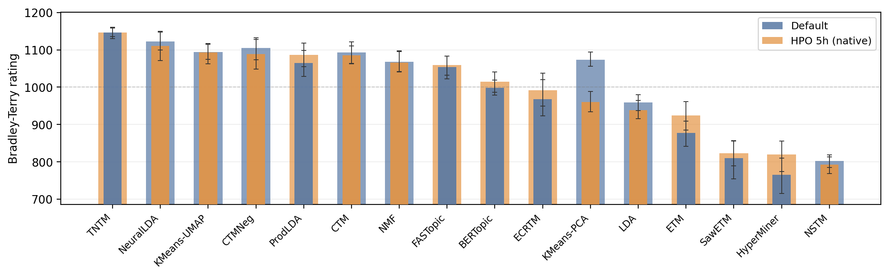
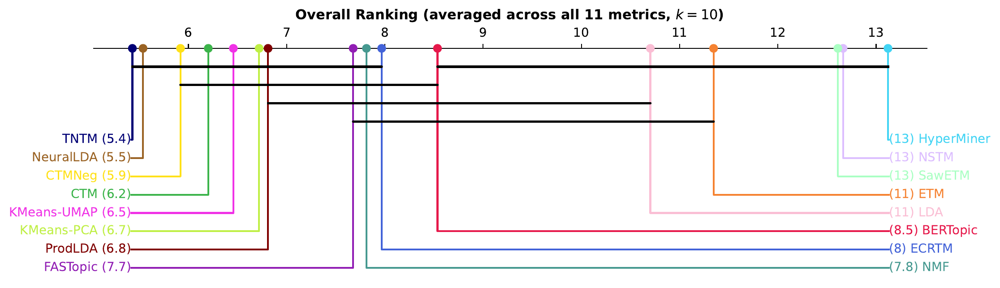

<div align="center">
  
</div>

<h1 align="center">TopicArena: Toward Reproducible Topic Model Evaluation</h1>

<p align="center">
  The largest and most comprehensive benchmark for topic models to date —
  <b>16 models</b> across <b>5 paradigms</b>, <b>18 datasets</b> from <b>9 domains</b>,
  <b>11 complementary metrics</b>, multi-seed stability analysis, human-validated
  LLM-as-a-judge evaluation, and a topic-count (<i>K</i>) sensitivity sweep.
</p>

---

## Overview

Topic models are a cornerstone of unsupervised text analysis, yet the field
suffers from a fundamental evaluation crisis: each new model claims superiority
over its predecessors, but these claims are evaluated on different datasets, with
different metrics, different baselines, and no repeated runs — making cross-paper
comparison effectively impossible.

**TopicArena** addresses this by evaluating every model on the same datasets, with
the same metrics and preprocessing, across multiple random seeds. The figure above
ranks models by a **Bradley–Terry** model fit to pairwise comparisons across all 11
metrics and 18 datasets (95% CI from 200 dataset-level bootstrap resamples), with
default and hyperparameter-tuned variants competing in a single tournament. Unlike
an Elo heuristic, Bradley–Terry is **order-independent and parameter-free** (no
K-factor, update order, or initialization), so the ranking depends only on aggregate
outcomes.

<div align="center">
  
</div>

The critical difference diagram above (Nemenyi test, α = 0.05, N = 18 datasets)
shows the overall ranking, computed by averaging per-dataset ranks across all 11
metrics at *k* = 10. Models connected by a bar are not significantly different.

### Key findings

1. **No single model dominates.** The best model changes entirely depending on
   whether you prioritize corpus coherence, embedding-based quality, or diversity.
2. **Rankings are sensitive to random initialization**, rendering most published
   single-run comparisons unreliable — stability requires multi-seed evaluation.
3. **Simple baselines remain competitive.** NMF and KMeans achieve high coherence
   at a fraction of the computational cost of neural models.

## Robustness analyses

Beyond the headline ranking, TopicArena includes analyses that stress-test the
conclusions:

- **Human-validated LLM judge.** The LLM-as-a-judge is validated against the
  canonical human study of topic interpretability
  ([Chang et al., 2009, *Reading Tea Leaves*](http://www.umiacs.umd.edu/~jbg/docs/nips2009-rtl.pdf)).
  On 4,168 human word-intrusion trials, the LLM (Claude Opus 4.6) **reproduces the
  human model ranking exactly** (LDA > pLSI > CTM), tracks human difficulty as the
  topic count grows, and agrees with the human majority on 83% of topics — evidence
  that it measures the same construct humans do, not merely correlating with
  automated metrics.

- **Order-independent aggregation (Bradley–Terry).** Model rankings are aggregated
  with a Bradley–Terry model rather than Elo. The two agree closely (Kendall
  τ = 0.95), but Bradley–Terry removes Elo's dependence on update order, K-factor,
  and initialization.

- **Within-dataset metric correlations.** Metric–metric agreement is computed
  *within each dataset* and then summarized across datasets, avoiding the
  cross-dataset pooling that can induce Simpson's-paradox artifacts.

- **Topic-count (*K*) sensitivity.** Each dataset is additionally evaluated at
  three topic counts bracketing its default *K* (≈ ½K, 1.5K, 2K, 5 seeds). Model
  rankings are stable across *K* — median Kendall τ = 0.75 across the 18 datasets
  (τ > 0.5 on 17 of 18) — confirming they are not an artifact of the chosen *K*.

Rebuttal / analysis scripts for these live in [`scripts/rebuttal/`](scripts/rebuttal/).

## What's in the benchmark

**16 models across 5 paradigms**

| Paradigm | Models |
|---|---|
| Classical | LDA, NMF |
| Clustering | KmeansTM, KmeansTM-PCA, BERTopic |
| Neural (VAE) | ETM, ProdLDA, NeuralLDA, CTM, CTMNeg, NSTM, ECRTM |
| Optimal transport | FASTopic |
| Hierarchical | SawETM, HyperMiner |
| Transformer-based | TNTM |

**18 datasets across 9 domains** — news, academic text, politics, social media,
reviews, Q&A, music, health, and encyclopedic text (2,225 – 119,993 documents).

**11 metrics × 4 top-*k* cutoffs** — 8 automated (Cᵥ, NPMI, TD, ISIM, INT, ISH,
Embedding-Coherence, Embedding-TD) plus 3 LLM-as-a-judge metrics (coherence rating,
intruder detection, label diversity), with NMI/Purity/Perplexity where labels exist.

The models and metrics build on the
[STREAM](https://aclanthology.org/2024.acl-short.41.pdf) topic modeling library,
which lives in this same repository under [`stream_topic/`](stream_topic/).

## Reproducing the benchmark

The benchmark harness lives in [`scripts/benchmark/`](scripts/benchmark/). By
default it writes results to the **local filesystem**, so the core benchmark
reproduces with no cloud account. It also scales to AWS SageMaker for the full
sweep. All environment-specific values are read from environment variables — see
[`scripts/benchmark/README.md`](scripts/benchmark/README.md) for the full guide.

### 1. Install

```bash
pip install -e .                                          # the stream_topic library
pip install -r scripts/benchmark/sagemaker/requirements.txt
```

### 2. Configure (optional)

```bash
cp scripts/benchmark/.env.example scripts/benchmark/.env  # defaults to local storage
```

### 3. Run

```bash
cd scripts/benchmark

python run_default_5seed.py     # default hyperparameters, 5 seeds (main results)
python run_hpo_5seed.py         # native-objective HPO + 5-seed evaluation
python run_hpo_cv_5seed.py      # Cᵥ-objective HPO + 5-seed evaluation
```

Results land under `scripts/benchmark/results/<dataset>/<version>/<model>/`. Runs
are idempotent — completed (dataset, model) combinations are skipped on re-run.

For the large-scale sweep on AWS SageMaker and the optional LLM-as-a-judge
evaluation, see the [benchmark README](scripts/benchmark/README.md).

## Using the STREAM library

`stream_topic` is also a standalone topic modeling library — fit any of the 16
models on your own corpus:

```python
from stream_topic.models import KmeansTM
from stream_topic.utils import TMDataset

dataset = TMDataset()
dataset.fetch_dataset("BBC_News")
dataset.preprocess(model_type="KmeansTM")

model = KmeansTM()
model.fit(dataset, n_topics=10)
print(model.get_topics())
```

See the [STREAM documentation](https://stream-topic.readthedocs.io/en/latest/index.html)
for the full library API, preprocessing options, and visualization tools.
