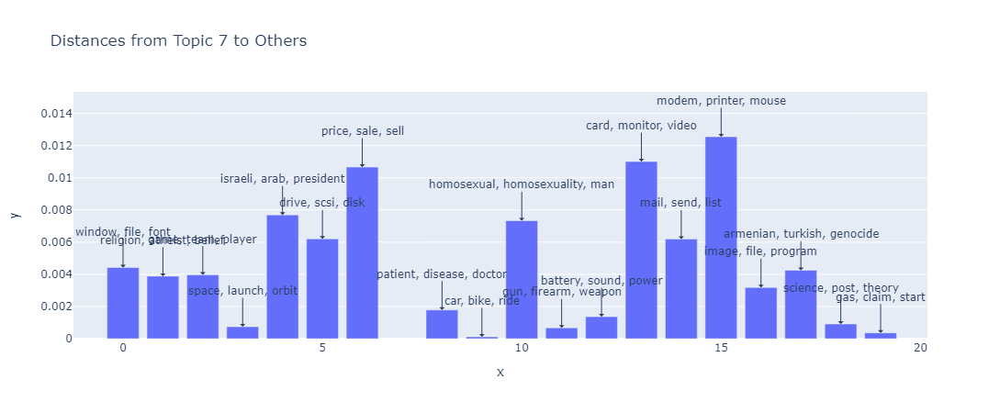

# STREAM
We present STREAM, a Simplified Topic Retrieval, Exploration, and Analysis Module for user-friendly topic modelling and especially subsequent interactive topic visualization and analysis. Our paper can be found [here](https://aclanthology.org/2024.acl-short.41.pdf).

For better topic analysis, we implement multiple intruder-word based topic evaluation metrics. Additionally, we publicize multiple new datasets that can extend the so far very limited number of publicly available benchmark datasets in topic modeling. We integrate downstream interpretable analysis modules to enable users to easily analyse the created topics in downstream tasks together with additional tabular information.

#### Speed
Since most of STREAMs models are centered around Document embeddings, STREAM comes along with a set of pre-embedded datasets.
Additionally, once a user fits a model that leverages document embeddings, the embeddings are saved and automatically loaded the next time the user wants to fit any model with the same set of embeddings.


Installation
=============
stream_topic is available on PyPI. To install STREAM, you can either install it directly from the GitHub repository using the following command:

```sh
pip install git+https://github.com/AnFreTh/STREAM.git
```

or simply install via:

```sh
pip install stream_topic
```

Make additionally sure to download the necessary [nltk](https://www.nltk.org/) ressources, e.g. via:

```python
import nltk
nltk.download('stopwords')
nltk.download('punkt')
nltk.download('wordnet')
nltk.download('averaged_perceptron_tagger')
```

# Available Models

STREAM offers a variety of neural as well as non-neural topic models and we are always trying to incorporate more and new models. If you wish to incorporate your own model, or want another model incorporated please raise an issue with the required information. Currently, the following models are implemented:

<div align="center" style="width: 100%;">
  <table style="margin: 0 auto;">
    <thead>
      <tr>
        <th><strong>Name</strong></th>
        <th><strong>Implementation</strong></th>
      </tr>
    </thead>
    <tbody>
      <tr>
        <td><a href="https://www.jmlr.org/papers/volume3/blei03a/blei03a.pdf?ref=http://githubhelp.com">LDA</a></td>
        <td>Latent Dirichlet Allocation</td>
      </tr>
      <tr>
        <td><a href="https://arxiv.org/abs/2004.14914">WordCluTM</a></td>
        <td>Tired of topic models?</td>
      </tr>
      <tr>
        <td><a href="https://direct.mit.edu/coli/article/doi/10.1162/coli_a_00506/118990/Topics-in-the-Haystack-Enhancing-Topic-Quality?searchresult=1">CEDC</a></td>
        <td>Topics in the Haystack</td>
      </tr>
      <tr>
        <td><a href="https://arxiv.org/pdf/2212.09422.pdf">DCTE</a></td>
        <td>Human in the Loop</td>
      </tr>
      <tr>
        <td><a href="https://direct.mit.edu/coli/article/doi/10.1162/coli_a_00506/118990/Topics-in-the-Haystack-Enhancing-Topic-Quality?searchresult=1">KMeansTM</a></td>
        <td>Simple Kmeans followed by c-tfidf</td>
      </tr>
      <tr>
        <td><a href="https://citeseerx.ist.psu.edu/document?repid=rep1&type=pdf&doi=b3c81b523b1f03c87192aa2abbf9ffb81a143e54">SomTM</a></td>
        <td>Self organizing map followed by c-tfidf</td>
      </tr>
      <tr>
        <td><a href="https://ieeexplore.ieee.org/abstract/document/10066754">CBC</a></td>
        <td>Coherence based document clustering</td>
      </tr>
      <tr>
        <td><a href="https://arxiv.org/pdf/2403.03737">TNTM</a></td>
        <td>Transformer-Representation Neural Topic Model</td>
      </tr>
      <tr>
        <td><a href="https://direct.mit.edu/tacl/article/doi/10.1162/tacl_a_00325/96463/Topic-Modeling-in-Embedding-Spaces">ETM</a></td>
        <td>Topic modeling in embedding spaces</td>
      </tr>
      <tr>
        <td><a href="https://arxiv.org/abs/2004.03974">CTM</a></td>
        <td>Combined Topic Model</td>
      </tr>
      <tr>
        <td><a href="https://arxiv.org/abs/2303.14951">CTMNeg</a></td>
        <td>Contextualized Topic Models with Negative Sampling</td>
      </tr>
      <tr>
        <td><a href="https://arxiv.org/abs/1703.01488">ProdLDA</a></td>
        <td>Autoencoding Variational Inference For Topic Models</td>
      </tr>
      <tr>
        <td><a href="https://arxiv.org/abs/1703.01488">NeuralLDA</a></td>
        <td>Autoencoding Variational Inference For Topic Models</td>
      </tr>
    </tbody>
  </table>
</div>


# Available Metrics

Since evaluating topic models, especially automatically, STREAM implements numerous evaluation metrics. Especially, the intruder based metrics, while they might take some time to compute, have shown great correlation with human evaluation. 
<div align="center" style="width: 100%;">
  <table style="margin: 0 auto;">
  <thead>
    <tr>
      <th><strong>Name</strong></th>
      <th><strong>Description</strong></th>
    </tr>
  </thead>
  <tbody>
    <tr>
      <td><a href="https://direct.mit.edu/coli/article/doi/10.1162/coli_a_00506/118990/Topics-in-the-Haystack-Enhancing-Topic-Quality?searchresult=1">ISIM</a></td>
      <td>Average cosine similarity of top words of a topic to an intruder word.</td>
    </tr>
    <tr>
      <td><a href="https://direct.mit.edu/coli/article/doi/10.1162/coli_a_00506/118990/Topics-in-the-Haystack-Enhancing-Topic-Quality?searchresult=1">INT</a></td>
      <td>For a given topic and a given intruder word, Intruder Accuracy is the fraction of top words to which the intruder has the least similar embedding among all top words.</td>
    </tr>
    <tr>
      <td><a href="https://direct.mit.edu/coli/article/doi/10.1162/coli_a_00506/118990/Topics-in-the-Haystack-Enhancing-Topic-Quality?searchresult=1">ISH</a></td>
      <td>Calculates the shift in the centroid of a topic when an intruder word is replaced.</td>
    </tr>
    <tr>
      <td><a href="https://direct.mit.edu/coli/article/doi/10.1162/coli_a_00506/118990/Topics-in-the-Haystack-Enhancing-Topic-Quality?searchresult=1">Expressivity</a></td>
      <td>Cosine Distance of topics to meaningless (stopword) embedding centroid</td>
    </tr>
    <tr>
      <td><a href="https://link.springer.com/chapter/10.1007/978-3-030-80599-9_4">Embedding Topic Diversity</a></td>
      <td>Topic diversity in the embedding space</td>
    </tr>
    <tr>
      <td><a href="https://direct.mit.edu/coli/article/doi/10.1162/coli_a_00506/118990/Topics-in-the-Haystack-Enhancing-Topic-Quality?searchresult=1">Embedding Coherence</a></td>
      <td>Cosine similarity between the centroid of the embeddings of the stopwords and the centroid of the topic.</td>
    </tr>
    <tr>
      <td><a href="https://aclanthology.org/E14-1056.pdf">NPMI</a></td>
      <td>Classical NPMi coherence computed on the source corpus.</td>
    </tr>
  </tbody>
</table>
</div>


# Usage

To use one of the available models, follow the simple steps below:
- Import the necessary modules:

    ```python
    from stream_topic.models import KmeansTM
    from stream_topic.utils import TMDataset
    ```
## Preprocessing

- Get your dataset and preprocess for your model:

    ```python
    dataset = TMDataset()
    dataset.fetch_dataset("20NewsGroup")
    dataset.preprocess(model_type="KmeansTM")
    ```

The specified model_type is optional and further arguments can be specified. Default steps are predefined for all included models.
Steps like stopword removal and lemmatizing are automatically performed for models like e.g. LDA.

## Model fitting

Fitting a model from STREAM follows a simple, sklearn-like logic and every model can be fit identically.

- Choose the model you want to use and train it:
   
    ```python
    model = KmeansTM()
    model.fit(dataset, n_topics=20)
    ```

Depending on the model, check the documentation for hyperparameter settings. To get the topics, simply run:

- Get the topics:

    ```python
    topics = model.get_topics()
    ```

## Evaluation

In this section, we describe the three metrics used to evaluate topic models' performance: **Intruder Shift (ISH)**, **Intruder Accuracy (INT)**, and **Average Intruder Similarity (ISIM)**.

- **Expressivity**: evaluates the meaningfulness of a topic by leveraging stopwords. Stopwords primarily serve a grammatical role and don't contribute to the document's meaning. This approach provides a quantifiable measure of how well a topic conveys meaningful information, distinct from grammatical structure alone.
- **Intruder Accuracy (INT)**: metric aims to improve the identification of intruder words within a topic. INT measures how effectively the intruder word can be distinguished from the top words in a topic. A larger value is better.
- **Average Intruder Similarity (ISIM)**: metric calculates the average cosine similarity between each word in a topic and an intruder word. To enhance the metrics' robustness against the specific selection of intruder words, ISH, INT, and ISIM are computed multiple times with different randomly chosen intruder words, and the results are averaged. These metrics provide insights into the performance of topic models and their ability to maintain topic coherence and diversity. A smaller value is better.
- **Intruder Shift (ISH)**: metric quantifies the shift in a topic's centroid when an intruder word is substituted. A lower ISH score indicates a more coherent and diverse topic model.


To evaluate your model simply use one of the metrics.

```python
from stream_topic.metrics import ISIM, INT, ISH,Expressivity, NPMI

metric = ISIM(dataset)
metric.score(topics)
```

Scores for each topic are available via:

```python
metric.score_per_topic(topics)
```

## Hyperparameter optimization

If you want to optimize the hyperparameters, simply run:

```python
model.optimize_and_fit(
    dataset,
    min_topics=2,
    max_topics=20,
    criterion="aic",
    n_trials=20,
)
```

## Visualization

You can also specify to optimize with respect to any evaluation metric from stream_topic.
Visualize the results:

```python
from stream_topic.visuals import visualize_topic_model,visualize_topics
visualize_topic_model(
    model, 
    reduce_first=True, 
    port=8051,
    )
```





## Downstream Tasks
In this setup, visualizing the shape function `k` reveals the impact of a topic on the target variable `y`. For example, in the context of the Spotify dataset, this could illustrate how a topic influences a song's popularity. Fitting a downstream model with a pre-trained topic model is straightforward using the PyTorch Trainer class. Subsequently, visualizing all shape functions can be done similarly to the approach described by Agarwal et al. (2021).

### How to use

```python
from lightning import Trainer
from stream_topic.NAM import DownstreamModel

# Instantiate the DownstreamModel
downstream_model = DownstreamModel(
    trained_topic_model=topic_model,
    target_column='target',  # Target variable
    task='regression',  # or 'classification'
    dataset=dataset,  
    batch_size=128,
    lr=0.0005
)

# Use PyTorch Lightning's Trainer to train and validate the model
trainer = Trainer(max_epochs=10)
trainer.fit(downstream_model)

# Plotting
from stream_topic.visuals import plot_downstream_model
plot_downstream_model(downstream_model)
```


## Contributing and Testing New Models

We welcome contributions to enhance the functionality of our topic modeling package. To ensure your new models integrate seamlessly, please follow the guidelines and testing instructions provided below.

### Steps for Contributing


1. **Fork the Repository**:

   - Fork the repository to your GitHub account.
   - Clone the forked repository to your local machine.

   ```bash
   git clone https://github.com/your-username/your-repository.git
   cd your-repository
   ```

2. **Create a New Branch**:

   - Ensure you are on the develop branch and create a new branch for your model development.

   ```bash
   git checkout develop
   git checkout -b new-model-branch
   ```

3. **Develop Your Model**:

   - Navigate to the `mypackage/models/` directory.
   - Create your model class file, ensuring it follows the expected structure and naming conventions.
   - Implement the required methods (`get_info`, `fit`, `predict`) and attributes (`topic_dict`). Optionally, implement `beta`, `theta`, or corresponding methods (`get_beta`, `get_theta`).

   

#### Example Model Structure

Here is an example of how your model class should be structured:

```python
import numpy as np
from mypackage.models.abstract_helper_models.base import BaseModel, TrainingStatus

class ExampleModel(BaseModel):
    def __init__(self, *args, **kwargs):
        super().__init__(*args, **kwargs)
        self._status = TrainingStatus.NOT_STARTED

    def get_info(self):
        return {"model_name": "ExampleModel", "trained": False}

    def any_other_processing_functions(self):
        pass

    def fit(self, dataset, n_topics=3):
        # do what you do during fitting the models
        self._status = TrainingStatus.INITIALIZED
        self._status = TrainingStatus.RUNNING
        self._status = TrainingStatus.SUCCEEDED

    def predict(self, texts):
        return [0] * len(texts)

    # If self.beta or self.theta are not assigned during fitting, plese include these two methods
    def get_beta(self):
        return self.beta

    def get_theta(self):
        return self.theta
```

#### Testing Your Model

1. **Install Dependencies**:

   - Ensure all dependencies are installed.

   ```bash
   pip install -r requirements.txt
   ```

2. **Validate Your Model**:

   - To validate your model, use `tests/validate_new_model.py` to include your new model class.

   ```python
   from tests.model_validation import validate_model

   validate_model(NewModel)
   ```

If this validation fails, it will tell you 

#### Validation Criteria

The following checks are performed during validation:
- Presence of required methods (`get_info`, `fit`, `predict`).
- Presence of required attributes (`topic_dict`).
- Either presence of optional attributes (`beta`, `theta`) or corresponding methods (`get_beta`, `get_theta`).
- Correct shape and sum of `theta`.
- Proper status transitions during model fitting.
- `get_info` method returns a dictionary with `model_name` and `trained` keys.

Refer to the `tests/model_validation.py` script for detailed validation logic.

#### Submitting Your Contribution

1. **Commit Your Changes**:

   - Commit your changes to your branch.

   ```bash
   git add .
   git commit -m "Add new model: YourModelName"
   ```

2. **Push to GitHub**:

   - Push your branch to your GitHub repository.

   ```bash
   git push origin new-model-branch
   ```

3. **Create a Pull Request**:

   - Go to the original repository on GitHub.
   - Create a pull request from your forked repository and branch.
   - Provide a clear description of your changes and request a review.

We appreciate your contributions and strive to make the integration process as smooth as possible. If you encounter any issues or have questions, feel free to open an issue on GitHub. Happy coding!

If you want to include a new model where these guidelines are not approriate please mark this in your review request.


# Citation

If you use this project in your research, please consider citing:

### Paper 1 TBD

```bibtex
@inproceedings{thielmann-etal-2024-stream,
    title = {STREAM: Simplified Topic Retrieval, Exploration, and Analysis Module},
    author = {Thielmann, Anton  and Reuter, Arik  and Weisser, Christoph  and Kant, Gillian  and Kumar, Manish  and S{\"a}fken, Benjamin},
    booktitle = {Proceedings of the 62nd Annual Meeting of the Association for Computational Linguistics (Volume 2: Short Papers)},
    year = {2024},
    publisher = {Association for Computational Linguistics},
    pages = {435--444},
}
```

###  Metrics and CEDC

```bibtex
@article{thielmann2024topics,
  title={Topics in the haystack: Enhancing topic quality through corpus expansion},
  author={Thielmann, Anton and Reuter, Arik and Seifert, Quentin and Bergherr, Elisabeth and S{\"a}fken, Benjamin},
  journal={Computational Linguistics},
  pages={1--37},
  year={2024},
  publisher={MIT Press One Broadway, 12th Floor, Cambridge, Massachusetts 02142, USA~…}
}
```

### TNTM

```bibtex
@article{reuter2024probabilistic,
  title={Probabilistic Topic Modelling with Transformer Representations},
  author={Reuter, Arik and Thielmann, Anton and Weisser, Christoph and S{\"a}fken, Benjamin and Kneib, Thomas},
  journal={arXiv preprint arXiv:2403.03737},
  year={2024}
}
```


### DCTE

```bibtex
@inproceedings{thielmann2024human,
  title={Human in the Loop: How to Effectively Create Coherent Topics by Manually Labeling Only a Few Documents per Class},
  author={Thielmann, Anton F and Weisser, Christoph and S{\"a}fken, Benjamin},
  booktitle={Proceedings of the 2024 Joint International Conference on Computational Linguistics, Language Resources and Evaluation (LREC-COLING 2024)},
  pages={8395--8405},
  year={2024}
}
```

### CBC

```bibtex
@inproceedings{thielmann2023coherence,
  title={Coherence based document clustering},
  author={Thielmann, Anton and Weisser, Christoph and Kneib, Thomas and S{\"a}fken, Benjamin},
  booktitle={2023 IEEE 17th International Conference on Semantic Computing (ICSC)},
  pages={9--16},
  year={2023},
  organization={IEEE}

```

If you use one of the Reddit or GME datasets, consider citing:

```bibtex
@article{kant2024one,
  title={One-way ticket to the moon? An NLP-based insight on the phenomenon of small-scale neo-broker trading},
  author={Kant, Gillian and Zhelyazkov, Ivan and Thielmann, Anton and Weisser, Christoph and Schlee, Michael and Ehrling, Christoph and S{\"a}fken, Benjamin and Kneib, Thomas},
  journal={Social Network Analysis and Mining},
  volume={14},
  number={1},
  pages={121},
  year={2024},
  publisher={Springer}
}
```